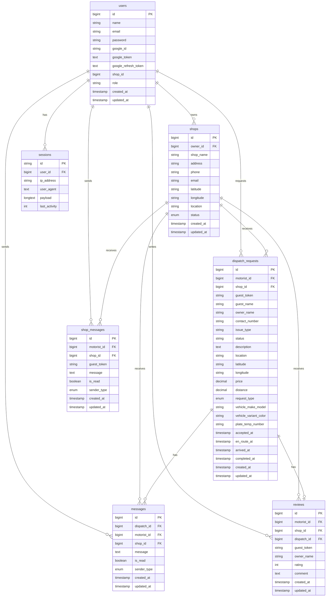
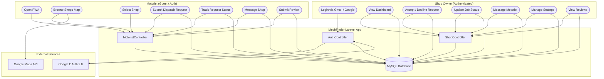
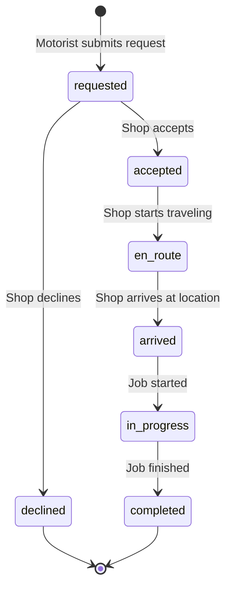

# MechFinder — System Documentation

## Overview

MechFinder is a Laravel 12 PWA-based dispatch and messaging platform that connects **motorists** (guests or registered) with **automotive repair shops**. Motorists can find nearby shops via GPS, submit service requests, track job status in real-time, message shops, and leave reviews — all without requiring an account.

---

## Tech Stack

| Layer | Technology |
|---|---|
| Backend | Laravel 12, PHP 8.2+ |
| Frontend | Blade, Tailwind CSS, Vite |
| Database | MySQL |
| Auth | Session + Google OAuth 2.0 (Gmail-only) |
| PWA | Service Worker + Web App Manifest |
| Real-time | AJAX polling |
| Deployment | Railway (production), Herd (local) |

---

## Entity Relationship Diagram (ERD)

---

## Data Flow Diagram (DFD)

---

## Dispatch Request Lifecycle

---

## Routes Reference

### Public
| Method | Route | Description |
|---|---|---|
| GET | `/` | Welcome / landing page |
| GET | `/login` | Login form |
| POST | `/login` | Process login |
| GET | `/signup` | Signup form |
| POST | `/signup` | Process registration |
| GET | `/auth/google/login` | Google OAuth login |
| GET | `/auth/google/signup` | Google OAuth signup |
| GET | `/auth/google/callback` | Google OAuth callback |

### Motorist (Public)
| Method | Route | Description |
|---|---|---|
| GET | `/motorist` | PWA home |
| GET | `/motorist/shops` | Shop list view |
| GET | `/motorist/shop/{id}` | Shop detail |
| POST | `/motorist/dispatch` | Submit dispatch request |
| GET | `/motorist/request/{id}` | Track request status |
| POST | `/motorist/review` | Submit review |
| GET | `/api/motorist/shops` | JSON shops with distance/ETA |
| POST | `/api/dispatch-requests` | Create dispatch (API) |
| GET | `/api/chat/{dispatchId}` | Get dispatch messages |
| POST | `/api/messages` | Send message |
| POST | `/api/reviews` | Submit review (API) |
| GET | `/api/motorist/shops-for-messaging` | Shops for messaging UI |
| GET | `/api/motorist/shop-messages/{shopId}` | Get conversation with shop |
| POST | `/api/motorist/shop-messages` | Send message to shop |

### Shop (Protected — requires auth)
| Method | Route | Description |
|---|---|---|
| GET | `/shop/dashboard` | Main dashboard |
| GET | `/shop/requests` | All requests with filters |
| GET | `/shop/jobs` | Active/completed jobs |
| GET | `/shop/messages` | Message conversations |
| GET | `/shop/reviews` | Reviews & analytics |
| GET | `/shop/settings` | Shop profile settings |
| POST | `/shop/accept/{id}` | Accept request |
| POST | `/shop/decline/{id}` | Decline request |
| POST | `/shop/request/{id}/status` | Update job status |
| GET | `/shop/dashboard-data` | AJAX — pending requests HTML |
| GET | `/shop/dashboard-map-data` | AJAX — map data JSON |
| POST | `/shop/settings/update` | Save shop settings |
| POST | `/shop/settings/toggle-status` | Toggle open/closed |
| GET | `/api/shop/status` | Get shop status (JSON) |
| GET | `/api/shop/messages/{dispatchId}` | Get messages for dispatch |
| POST | `/api/shop/messages/send` | Send message to motorist |

---

## Database Tables

| Table | Purpose |
|---|---|
| `users` | Shop owner accounts (Gmail/Google OAuth) |
| `shops` | Shop profiles with GPS coordinates and status |
| `dispatch_requests` | Service requests with full lifecycle tracking |
| `reviews` | Star ratings and comments per shop |
| `messages` | Dispatch-specific chat messages |
| `shop_messages` | Direct motorist-shop conversations (supports guests) |
| `sessions` | Laravel session storage |

---

## PWA Setup

- **Manifest:** `/public/manifest-motorist.json`
- **Service Worker:** `/public/sw-motorist.js`
- **Scope:** `/motorist/`
- **Strategy:** Network-first with cache fallback
- **Installable on:** Android Chrome, iOS Safari (Add to Home Screen)
